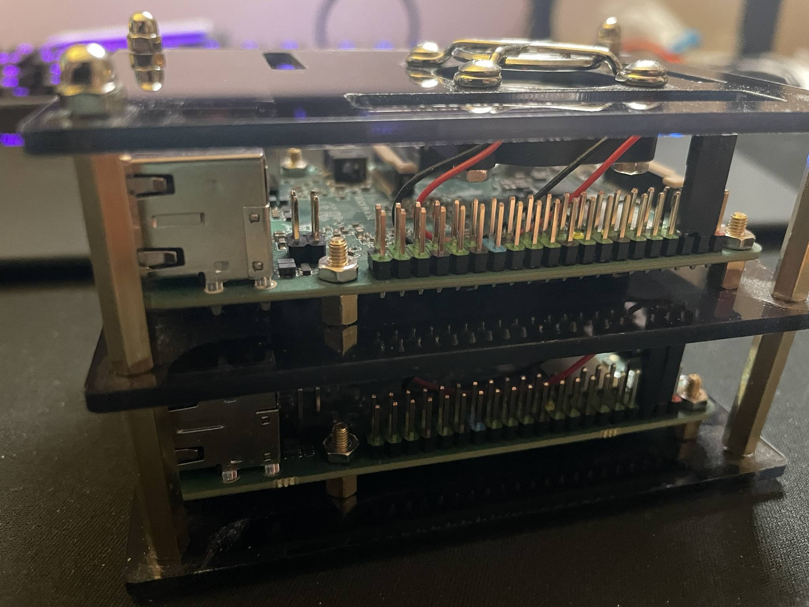

# MicroK8s Cluster on Radxa ROCK Pi 4 SE

This repository documents the process of setting up a lightweight Kubernetes cluster using MicroK8s on multiple Radxa ROCK Pi 4 SE single-board computers. The guide includes step-by-step instructions, configuration files, and troubleshooting tips.

## Features

- **Hardware**:
  - [Radxa ROCK 4SE](https://radxa.com/products/rock4/4se)
  - GeeekPi Cluster Case [[Amazon SE](https://www.amazon.se/dp/B07MW24S61)] [[Amazon US](https://www.amazon.com/dp/B07MW24S61)]
  - Power supply GaN 165W (or something similar) [[Amazon SE](https://www.amazon.se/dp/B0C4KKXDS2)]
  - SanDisk Extreme microSDXC 64 GB (one for each computer)
  - Fulfalic 4k HDMI Video Capture Card (this is just for the streaming) [[Amazon SE](https://www.amazon.se/dp/B0BJ2YDV7Q)] [[Amazon US](https://www.amazon.com/dp/B0BJ2YDV7Q)]
- **Kubernetes Distribution**: MicroK8s
- **Purpose**: Lightweight, efficient Kubernetes cluster for development and learning.



## Contents

- **Setup Guide**: Detailed steps for installing MicroK8s and configuring the cluster.
- **Configuration Files**: Pre-configured YAML files for quick deployment.
- **Troubleshooting**: Solutions to common issues.
- **Resources**: Links to official documentation and additional tools.

## Getting Started

1. Clone the repository:
   ```bash
   git clone https://github.com/LittleAndi/rock-pi-microk8s-cluster.git
   cd rock-pi-microk8s-cluster
   ```
2. Follow the [Setup Guide](setup-guide.md) to begin.

## Contributions

I'm streaming most of the setup on https://www.twitch.tv/littleandi77.

Contributions, feedback, and suggestions are welcome! Feel free to open an issue or submit a pull request.
